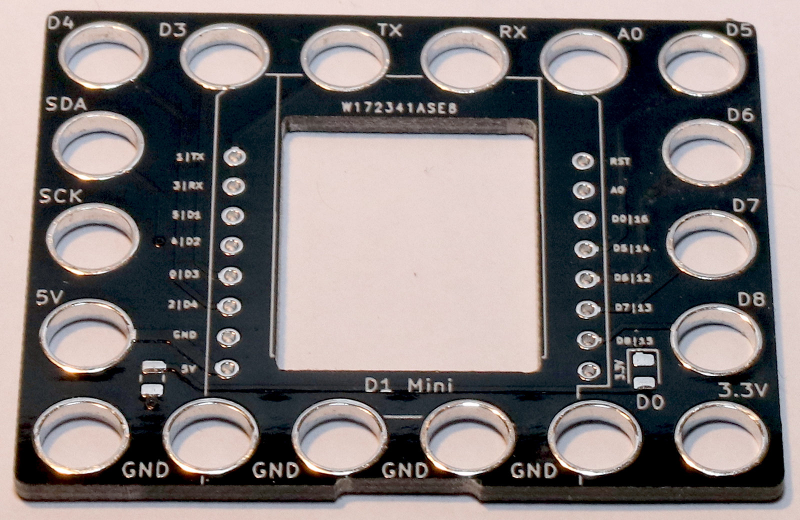
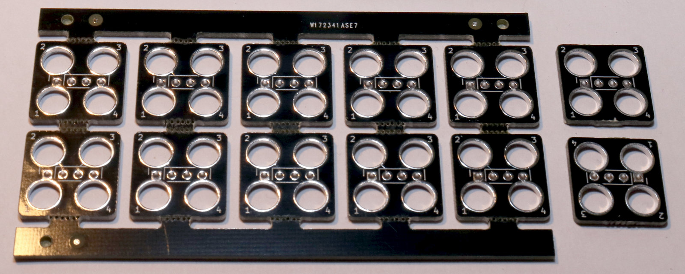
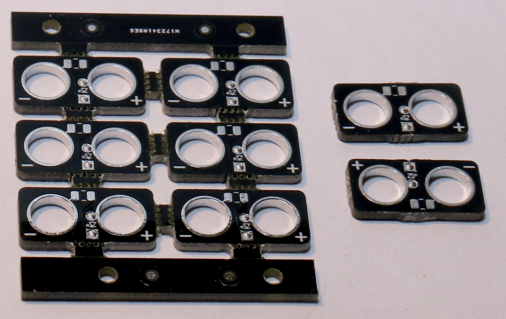

# PCBs

These are the PCBs that can be used to create the hardware elements shown here.

## LegoD1mini

The main controller hosting the D1 Mini

## Lego4Pins

A PCB providing 4 connection pins in the center of a 2 by 2 square

## LegoLED

A PCB providing connections for a single THT LED with a SMD resistor

