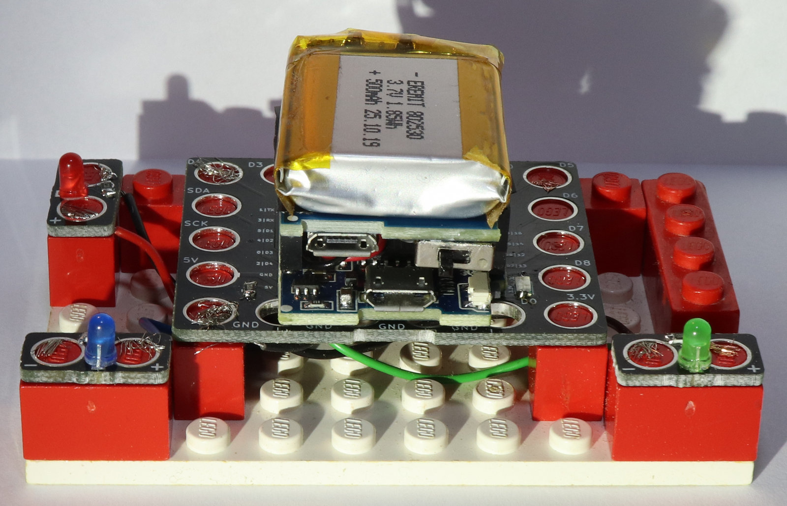

# D1MiniLegoControl
### A simple example HTTP server to comtrol a custom lego adapter

This project aims to include a programmable component into LEGO builds switching LEDs and buzzers and other devices.

The core is a D1 Mini offering:

* Digital inputs and outputs
* Analog inputs
* I²C devices (like displays)
* WiFi client and hotspot

Access to the D1 Mini functions is provided via a WiFi hotspot and HTML web interface. 

## Default values

* WiFi SSID: **LEGO Control**
* Password: **lgctrl12345**
* Interface: **http://192.168.168.1/**

## Current state

ATM only switching the digital outputs is included.
